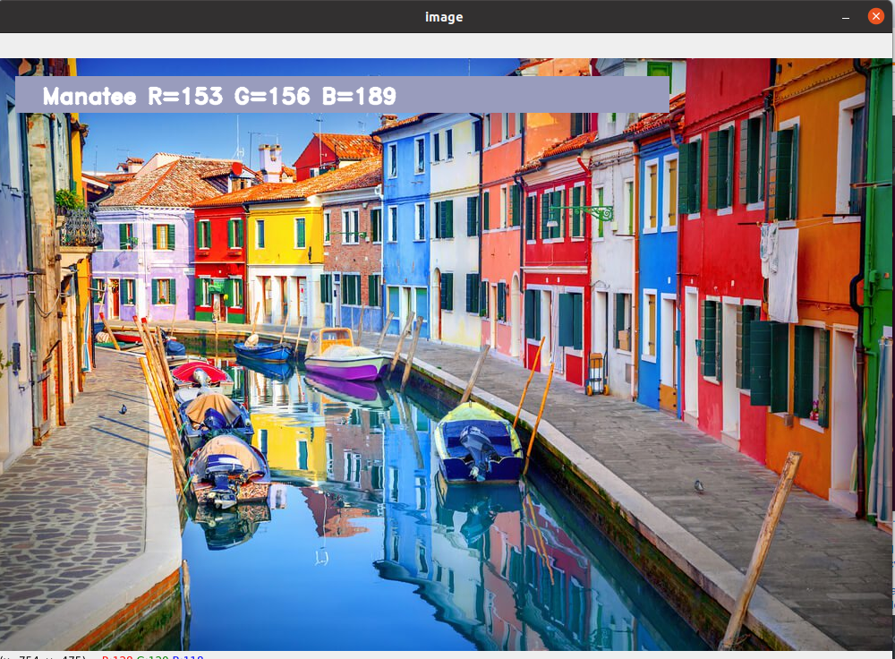

#About This Project
In this color detection Python project, we are going to build an application through which you can automatically get the name of the color by clicking on them. So for this, we will have a data file that contains the color name and its values. Then we will calculate the distance from each color and find the shortest one.

###The DataSet 
Colors are made up of 3 primary colors; red, green, and blue. In computers, we define each color value within a range of 0 to 255. So in how many ways we can define a color? The answer is 256*256*256 = 16,581,375. There are approximately 16.5 million different ways to represent a color. In our dataset, we need to map each color’s values with their corresponding names. But don’t worry, we don’t need to map all the values. We will be using a dataset that contains RGB values with their corresponding names. The CSV file for our dataset has been taken from this link:

[a link]("https://github.com/venkateshtantravahi/ColorDetection/colors.csv")

`The colors.csv file includes more than 865 color names along with their RGB and hex values.`

##PreRequisites
To Run the file the following packages needed to be installed

If you are installing Packages through pip or conda both works fine
```
pip install opencv-python numpy pandas
```

###Few Steps For Building and running the Project
Here are the steps to run the code in Python that can detect colors:
###1.Download the code or clone it from Repository
The project folder contains 3 files:

    Color_detection.py – main source code of our project.
    Colorpic.jpg – sample image for experimenting.
    Colors.csv – a file that contains our dataset.`

###2. Taking an image from the user
We are using argparse library to create an argument parser. We can directly give an image path from the command prompt:
` import argparse
  ap = argparse.ArgumentParser()
  ap.add_argument('-i', '--image', required=True, help="Image Path")
  args = vars(ap.parse_args())
  img_path = args['image']
  img = cv2.imread(img_path)
 `

###3. Next, we read the CSV file with pandas
The pandas library is very useful when we need to perform various operations on data files like CSV. pd.read_csv() reads the CSV file and loads it into the pandas DataFrame. We have assigned each column with a name for easy accessing.

`
  index=["color","color_name","hex","R","G","B"] 
  csv = pd.read_csv('colors.csv', names=index, header=None)
`
###4. Set a mouse callback event on a window
First, we created a window in which the input image will display. Then, we set a callback function which will be called when a mouse event happens.
`cv2.namedWindow('image')
 cv2.setMouseCallback('image',draw_function)`
 
 With these lines, we named our window as ‘image’ and set a callback function which will call the draw_function() whenever a mouse event occurs.
 
 ###5. Create the draw_function
It will calculate the rgb values of the pixel which we double click. The function parameters have the event name, (x,y) coordinates of the mouse position, etc. In the function, we check if the event is double-clicked then we calculate and set the r,g,b values along with x,y positions of the mouse.
`def draw_function(event, x,y,flags,param):
    if event == cv2.EVENT_LBUTTONDBLCLK:
        global b,g,r,xpos,ypos, clicked
        clicked = True
        xpos = x
        ypos = y
        b,g,r = img[y,x]
        b = int(b)
        g = int(g)
        r = int(r)`

###6. Calculate distance to get color name
We have the r,g and b values. Now, we need another function which will return us the color name from RGB values. To get the color name, we calculate a distance(d) which tells us how close we are to color and choose the one having minimum distance.

Our distance is calculated by this formula:

d = abs(Red – ithRedColor) + (Green – ithGreenColor) + (Blue – ithBlueColor)

`def getColorName(R,G,B):
    minimum = 10000
    for i in range(len(csv)):
        d = abs(R- int(csv.loc[i,"R"])) + abs(G- int(csv.loc[i,"G"]))+ abs(B- int(csv.loc[i,"B"]))
        if(d<=minimum):
            minimum = d
            cname = csv.loc[i,"color_name"]
    return cname`
    
###7. Display image on the window
Whenever a double click event occurs, it will update the color name and RGB values on the window.

Using the cv2.imshow() function, we draw the image on the window. When the user double clicks the window, we draw a rectangle and get the color name to draw text on the window using cv2.rectangle and cv2.putText() functions.

```
while(1):
    cv2.imshow("image",img)
    if (clicked):
        cv2.rectangle(img,(20,20), (750,60), (b,g,r), -1)
        text = getColorName(r,g,b) + ' R='+ str(r) + ' G='+ str(g) + ' B='+ str(b)

        #cv2.putText(img,text,start,font(0-7), fontScale, color, thickness, lineType, (optional bottomLeft bool) )
        cv2.putText(img, text,(50,50),2,0.8,(255,255,255),2,cv2.LINE_AA)
  
        if(r+g+b>=600):
            cv2.putText(img, text,(50,50),2,0.8,(0,0,0),2,cv2.LINE_AA)

        clicked=False

    #Break the loop when user hits 'esc' key 
    if cv2.waitKey(20) & 0xFF ==27:
        break
cv2.destroyAllWindows()
```
###8. Run Python File
you can run the Python file from the command prompt or shell or terminal. Make sure to give an image path using ‘-i’ argument. If the image is in another directory, then you need to give full path of the image:
```
python color_detection.py -i <add your image path here>
```


